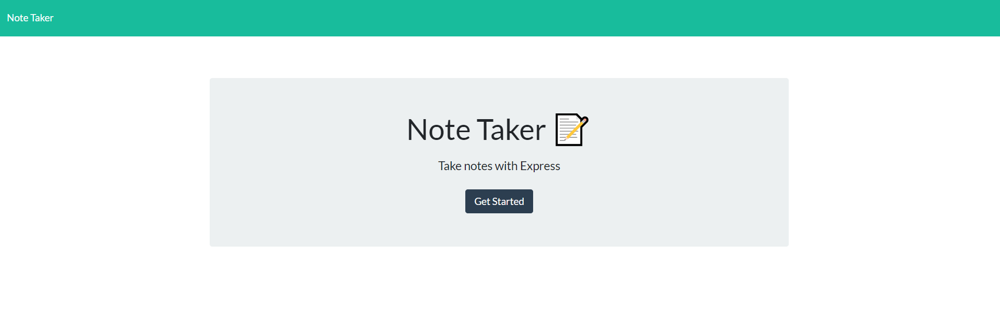
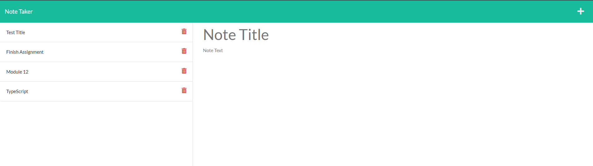
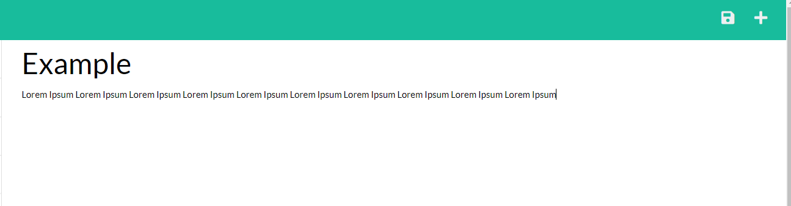

# Note Taker

## About the Project

This application was created to provide you with a way to write, save, and delete notes through a server. The server is currently being hosted by Heroku. When you open the application the first thing you will see is the home page. Simply click the "Get Started" button and it will take you to a new page that displays the notes you already have saved and gives you the ability to create/delete a note. Saving and deleting notes through a server saves you from having to use localStorage and accidentally losing all of your notes if your localStorage gets cleared on accident. It also ensures that you can access your notes from any device without needing the localStorage from the device you would have stored it on.

## Built With:

### Front End

### Back End

### Server

## Here's a link to the deployed application

https://lit-garden-80441.herokuapp.com/ (Server hosted through Heroku)

## Here's a preview of what the application looks like!

#### The Home Page

#### The Notes Page

#### Creating a new note

## Contribution:

Made by Mitchell Armstrong

## Contact

Mitchell Armstrong - mra0211@gmail.com
